# 6 GPU Mining Rig

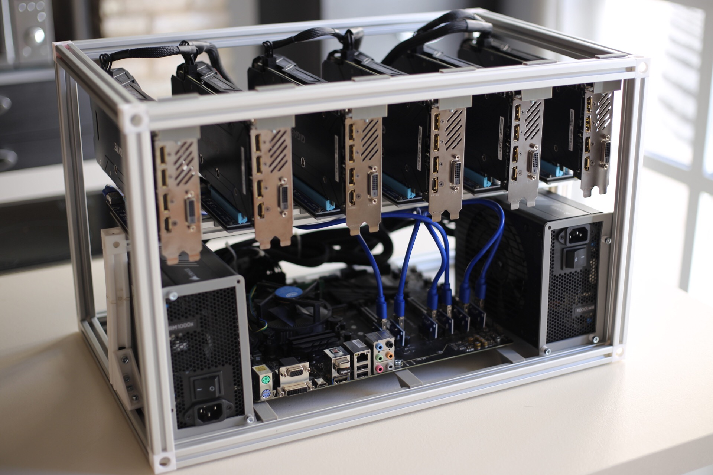

## General info

* Dimensions: 540x340x340mm
* Support for two PSUs
* Stackable
* Build cost: ~€60

### 💰 Donations

If you successfully build one I would appreciate some kickback ☺️

* **BTC:** `1K7Uc9MDzokCGEsUxrQQXn59VQ1Q9AWGvZ`
* **BCH:** `1BHM8oACVN6F4xksXAAP3nR9EoAkfd8sGF`
* **ETH:** `0x8CcA7589d8061ad4D3D913412d1EAD71cbEae081`
* **LTC:** `LRJ4Evzmyynp8Uswiy7e2uWhPKBNiSHroq`

## Parts, materials and tools

### Metal
* 5x 2020 500mm profiles
* 8x 2020 300mm profiles
* 2x 2020 150mm profiles
* 16x M3 8mm screws
* 40x M4 8mm screws
* 8x PC case 4mm screws
* 40x M4 nuts
* 28x M6 16mm screws (Make sure to get flat, countersunk screwheads)
* Zip ties

### 3D Printed

* 6x [GPU Bracket Rail](parts/GPUBracketRail.stl)
* 6x [Raiser Rail](parts/RaiserRail.stl)
* [PSU Frame Left](parts/PSUFrameLeft.stl)
* [PSU Frame Right](parts/PSUFrameRight.stl)
* [62mm Mobo Bracket Rail](parts/MoboBracketRail62mm.stl)
* 2x [40mm Mobo Bracket Rail](parts/MoboBracketRail40mm.stl)
* 3x [33mm Mobo Bracket Rail](parts/MoboBracketRail33mm.stl)
* 4x [Right Angle Bracket](parts_others/90_bracket.stl)
* 10x [2020 Corner Connector](parts_others/2020_connect_v2.stl)
* 40x [T Slot nut](parts_others/t_slot_nut_m4.stl)
* 4x [Feet_v1](parts/Feet_v1.stl)

### Tools

* Drill
* M6 screw tap
* 3D Printer

## Assembly

**Note:** Any dimensions are measured on the inner parts of the frame.

#### 1. Thread all the profiles
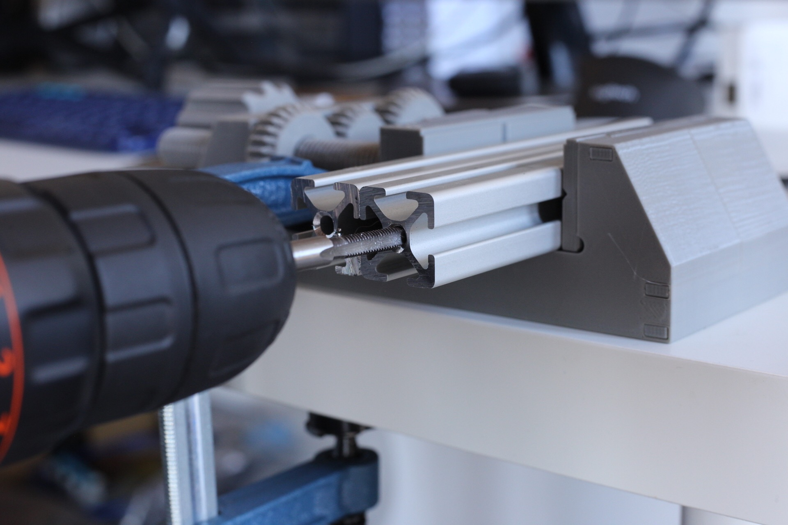

#### 2. Put M4 nuts into all printed T Slot nuts

#### 3. Place the T Slot nuts in the following profiles:
	* 2x 6 nuts in 500mm
	* 7 nuts in 500mm
	* 3 nuts in 400mm
	* 4x 2 nuts in 300mm

#### 4. Screw the frame together using the M6 screws, 300mm+500mm profiles and the 2020 Corner Connectors

#### 5. Screw the PSU frames to both power supplies
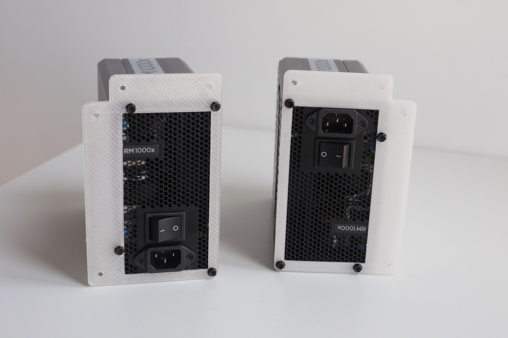

#### 6. Screw the PSU support Right Angle Brackets
**Note:** ~116mm from the back.
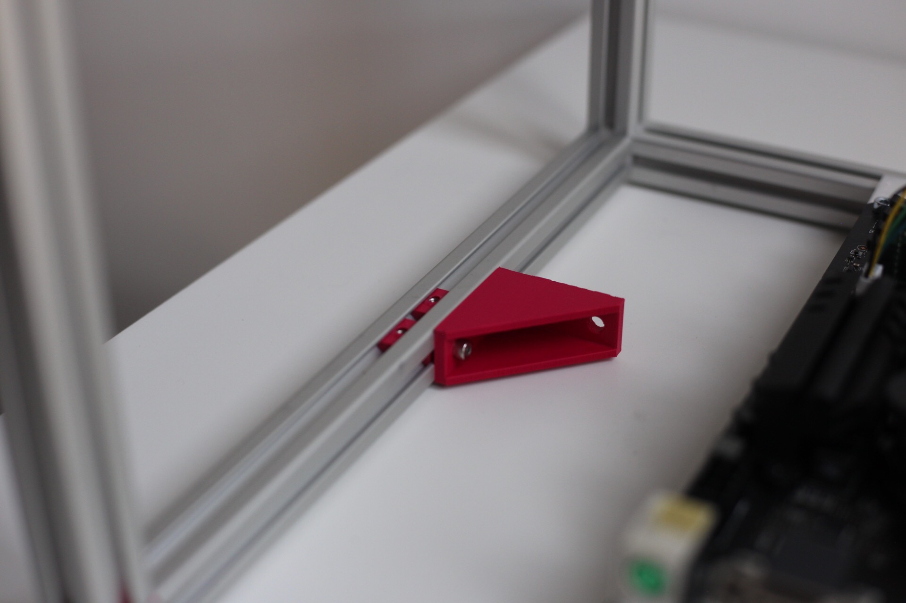

#### 7. Screw the MOBO standoffs and MOBO
**Note:** Leave ~100mm on both sides.
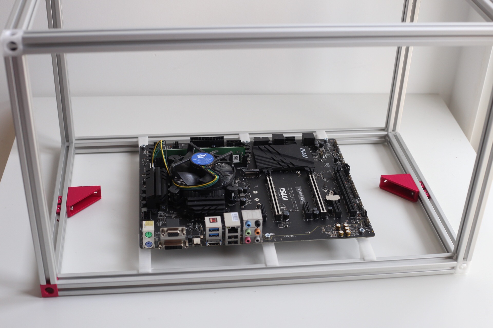

#### 8. Screw the PSUs to the main frame
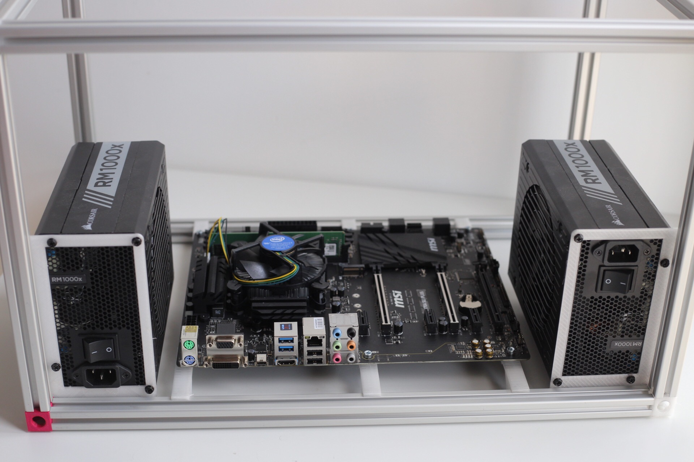

#### 9. Screw the raiser beam using the M6 screws, 150mm+500mm profiles and the two 2020 Corner Connectors to the frame using Right Angle Brackets
**Note:** 100mm from the front.
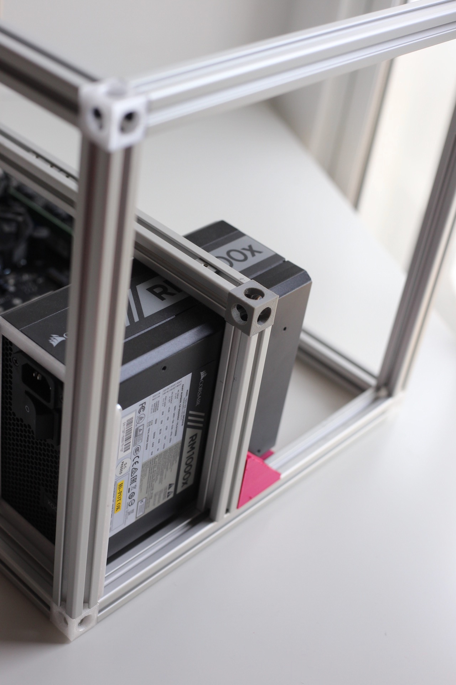

#### 10. Screw the Raiser Rails to the beam using M4 screws
**Note:** Place the first one by the left edge and then space other ones 44mm apart.
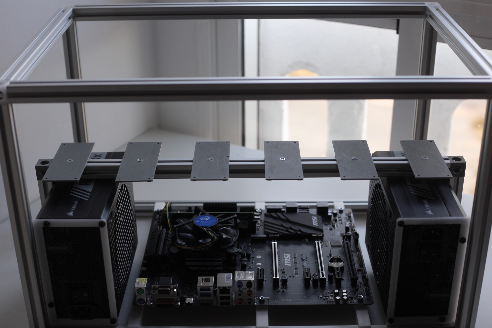

#### 11. Screw the GPU Bracket Rails to the upper part of the frame
**Note:** Place the first one by the right edge and then space other ones 55mm apart.
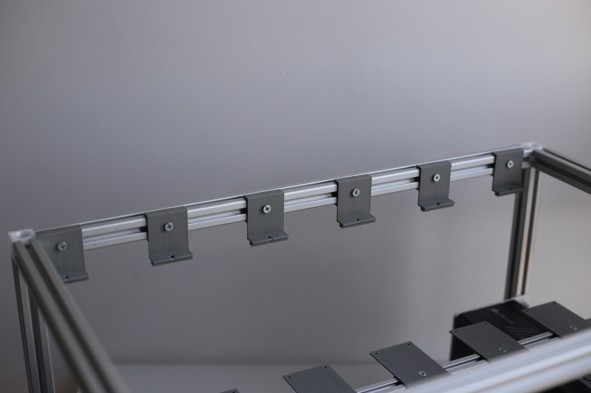

#### 12. Screw the raisers to the Raiser Rails with M3 screws
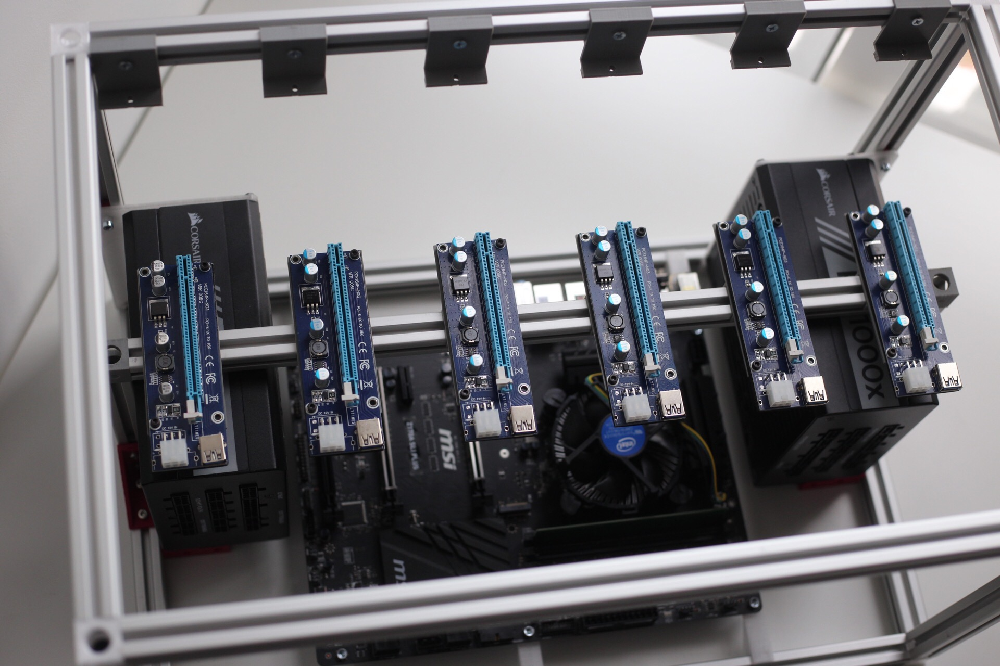

#### 13. Wire up the raiser data cables
**Note:** Don't tie the cables yet, that's the last step.

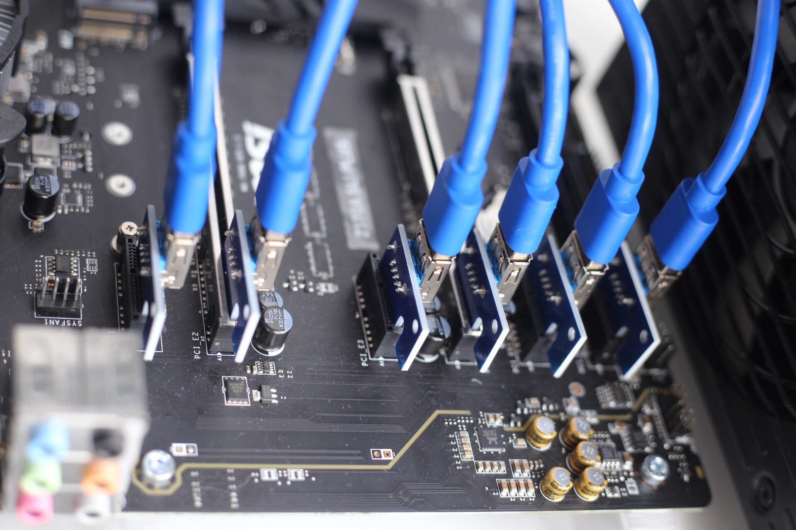

#### 14. Wire up the raiser and MOBO power cables
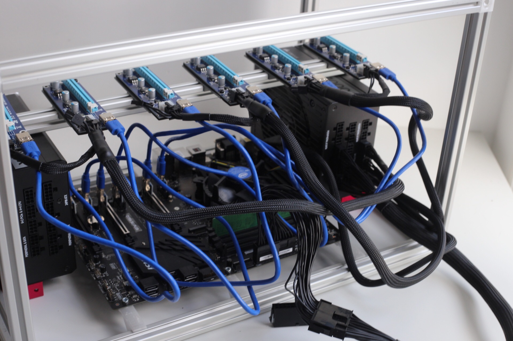

#### 15. Place all the GPUs and screw them to the GPU Bracket Rails

#### 16. Wire up GPU power cables

#### 17. Boot up and check if everything works correctly

#### 18. Use zip ties to clean up the cables

I recommend using [ethOS](http://ethosdistro.com) to manage your rigs. The setup very easy and fast saving a ton of work when configuring / managing more GPUs.

## 3rd Party Copyrights
Components in `parts_others` directory have been designed by following people:
* [2020 Corner Connector](https://www.thingiverse.com/thing:1100779) by [woodywong](https://www.thingiverse.com/woodywong/about)
* [Right Angle Bracket](https://www.thingiverse.com/thing:1810199) by [DCGTek](https://www.thingiverse.com/dcgtek/about)
* [T Slot nut](https://www.thingiverse.com/thing:1573410) by [Tomasz Mankiewicz](https://www.thingiverse.com/tomaq/about)
